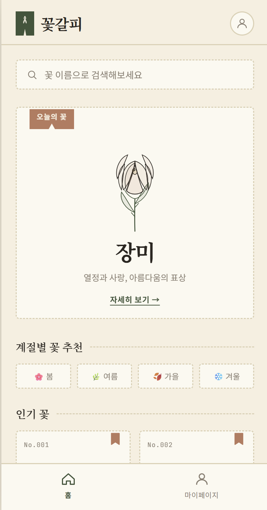
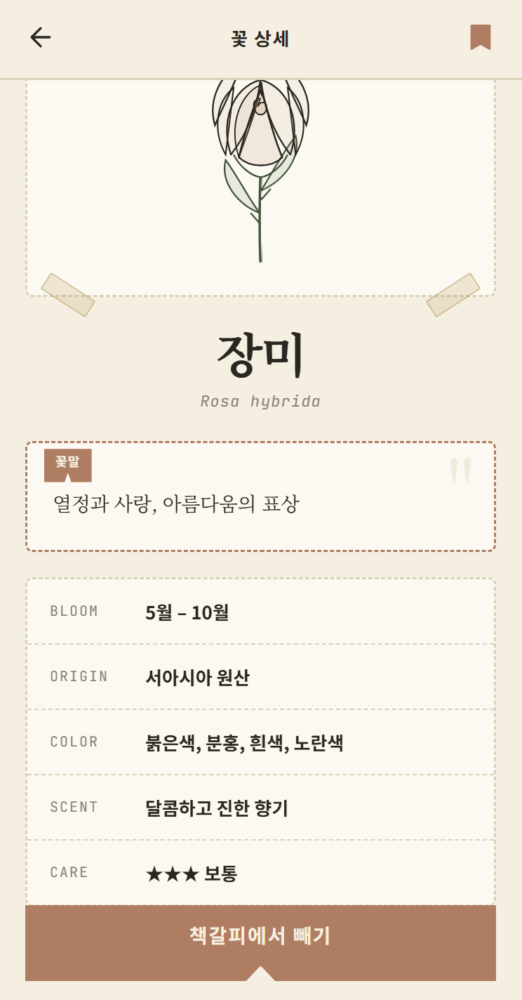
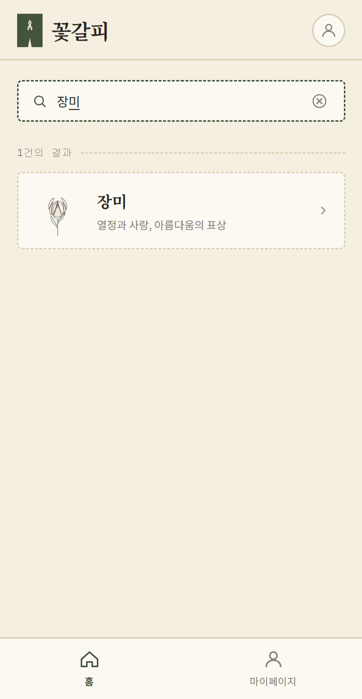
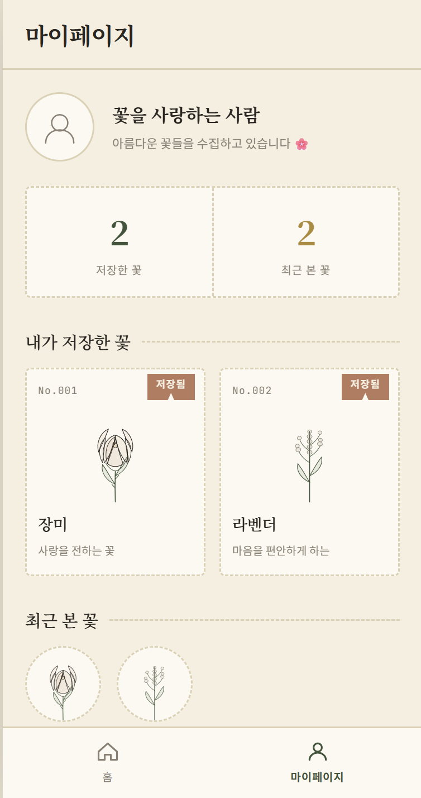

# 꽃갈피 (Kkotgalpi)

압화(눌러 말린 꽃) 표본집과 책갈피 리본을 모티브로 한 꽃 정보 아카이빙 앱입니다.

**Figma Make 프로젝트**: [꽃갈피 모바일 앱 – Figma Make](https://www.figma.com/make/2RmTIKKyBqK8oc4mhkO25F/%EA%BD%83%EA%B0%88%ED%94%BC-%EB%AA%A8%EB%B0%94%EC%9D%BC-%EC%95%B1?code-node-id=0-6&p=f&t=PQkOXqcVpCyeiQse-0&fullscreen=1)

## UI 디자인

### 1. 메인 / 꽃 검색
검색바, 오늘의 꽃 추천 카드, 계절별 꽃 추천, 인기 꽃 리스트를 보여주는 홈 화면입니다.

### 2. 꽃 상세
표본 마운트 스타일의 꽃 이미지와 꽃 이름, 꽃말, 상세 정보, 저장 버튼을 제공하는 화면입니다.

### 3. 검색 결과
검색어에 해당하는 꽃을 리스트로 보여주는 화면입니다.

### 4. 마이페이지 / 저장한 꽃
프로필과 저장한 꽃 리스트, 최근 본 꽃을 확인할 수 있는 화면입니다.

